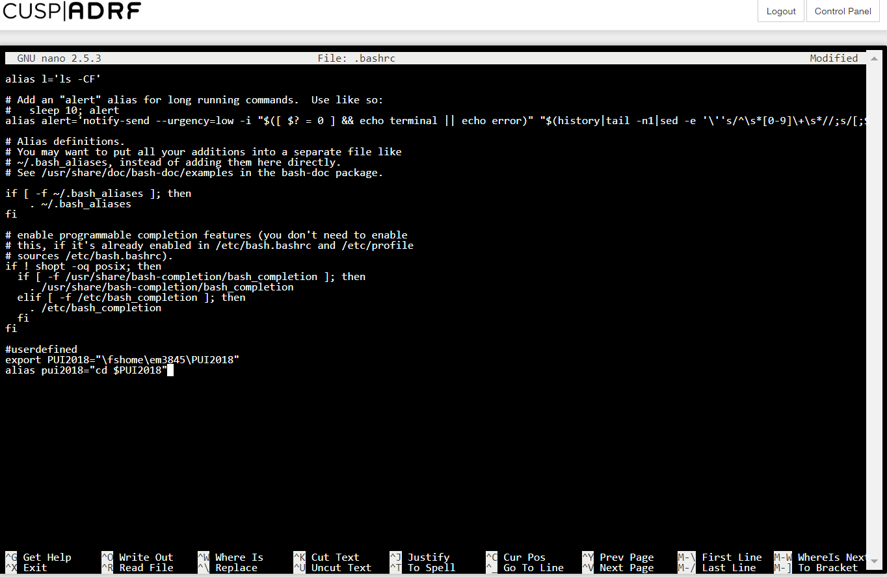
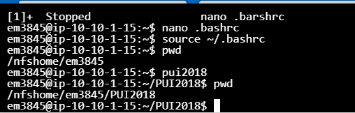

## Homework 1

Purpose of the assignment was to create environmental variables: a temporary, and a constant.

For the first task, I used bash commands in terminal to declare and define enrironmental variable for a single session.

For the second one, I modified the .bashrc file to create a constant environmental variable and alias.

