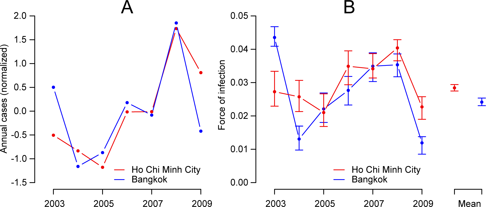
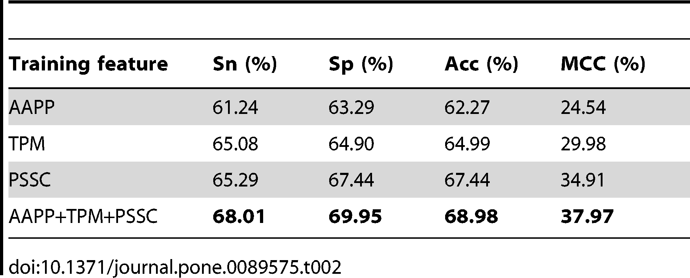

# Assignment 2:

## Paper 1
| **Statistical Analyses**	|  **IV(s)**  |  **IV type(s)** |  **DV(s)**  |  **DV type(s)**  |  **Control Var** | **Control Var type**  | **Question to be answered** | **_H0_** | **alpha** | **link to paper**| 
|:----------:|:----------|:------------|:-------------|:-------------|:------------|:------------- |:------------------|:----:|:-------:|:-------|
ANOVA	| 3, APL result (1, 2, 3) | Categorical | 1, Height| Continuous | none | none | Does height in early years differ for players who achieved later on APL1, 2 or 3 | There is no significant difference in height among APL1,2 and 3 players | - | [The influence of speed abilities and technical skills in early adolescence on adult success in soccer: A long-term prospective analysis using ANOVA and SEM approaches](https://journals.plos.org/plosone/article?id=10.1371/journal.pone.0182211) |
  |||||||||
  

## Paper 2

| **Statistical Analyses**	|  **IV(s)**  |  **IV type(s)** |  **DV(s)**  |  **DV type(s)**  |  **Control Var** | **Control Var type**  | **Question to be answered** | **_H0_** | **alpha** | **link to paper**| 
|:----------:|:----------|:------------|:-------------|:-------------|:------------|:------------- |:------------------|:----:|:-------:|:-------|
Correlation	| 1, Year | Continuous | 1, Annual mumber of cases| Continuous | none | none | 	Is number of Dengue cases in Bangkok correlated with number of cases in Ho Chi Minh | Correlation between occurences in Ho Chi Minh and Bangkok is low | 0.05 | [Synchrony of Dengue Incidence in Ho Chi Minh City and Bangkok](https://journals.plos.org/plosntds/article?id=10.1371/journal.pntd.0005188) |
  |||||||||
  

## Paper 3

| **Statistical Analyses**	|  **IV(s)**  |  **IV type(s)** |  **DV(s)**  |  **DV type(s)**  |  **Control Var** | **Control Var type**  | **Question to be answered** | **_H0_** | **alpha** | **link to paper**| 
|:----------:|:----------|:------------|:-------------|:-------------|:------------|:------------- |:------------------|:----:|:-------:|:-------|
Logistic regression	| 3, AAPP, TPM, PSSC | Categorical | 1, Lysine acetylation occurence (4 types of disease were being predicted)| Dichotomous | none | none | 	To what extent can lysine acetylation occurence be identified using AAPP, TPM and PSSC | Probability of lysine acelytation occurence can not be infered from AAPP, TPM, PSSC variables | - | [LAceP: Lysine Acetylation Site Prediction Using Logistic Regression Classifiers](https://journals.plos.org/plosone/article?id=10.1371/journal.pone.0089575) |
  |||||||||
  

