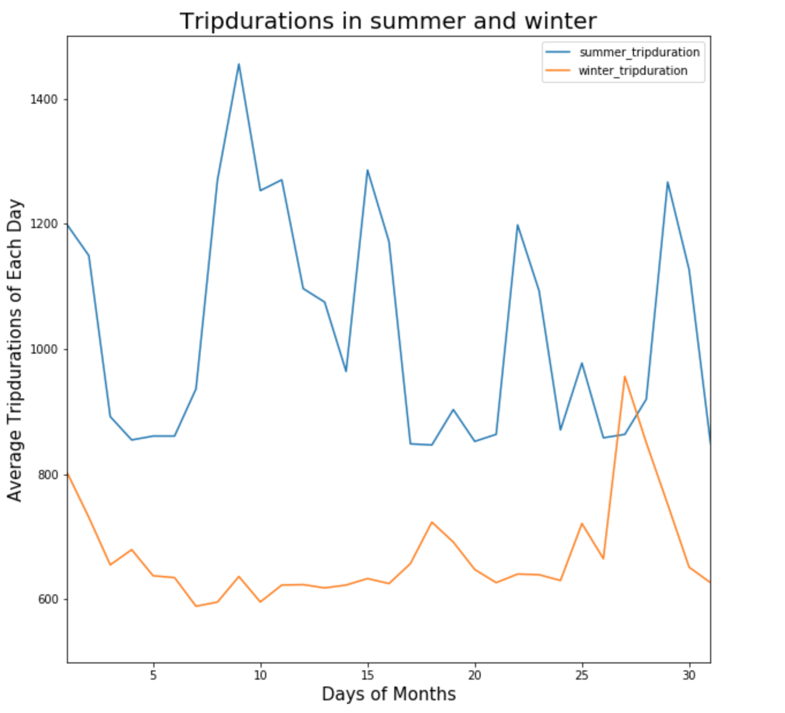

Peer Plot 2

In this assignment I rviewd the plot by Jiawen Liang below:

The following plot represent average trip duration per day in the month in winter and summer. From technical point of view the graph has a title and names of x and y axes. I can understand th eidea of comparing the tirp duration per day by season. One thing I miss in the graph is the unit for trip duration. I assume it's seconds but adding this information would be helpful. One thing thatI found confusing while reading labels and the title is specification of what months are being used. X label "Days of Months" does not specify if it is days of all winter and summer months, or a selected few, or one? I would suggest clarifying that in either description or the label or changing the graph so as it shows all months consequitevely rather than cummulatively. Also for Y axis "Average Trip Duration", with unit, would be sufficient.

Form clarity and aesthetics point of view I found the plot being good. Colors are selected deliberately with contrast (though orange would conceptually match summer better than blue). It is also very easy to read and see that there might exist a significant difference between the two values studied. Selection of line graph in that context is appropriate too, since we can consider time to be continuous.

When it comes to honesty, I think it would be useful to clarify what data has been studied for both winter and summer. Currently I can not elaborate, but honesty issue would be in case two different boroughs were studied - then of course the average might differ, bu not neccessarily because of the season. 